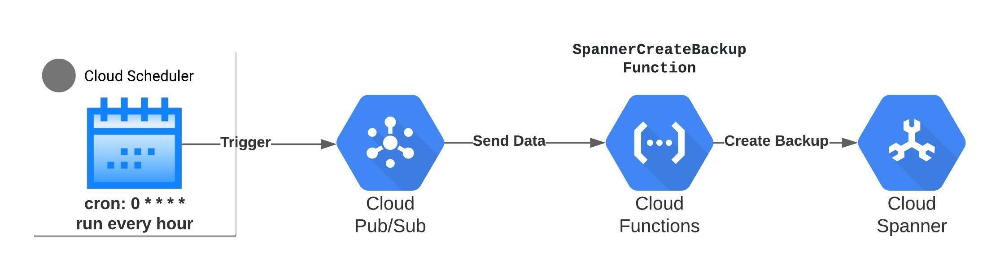

<h1>Automated Backups for Cloud Spanner</h1>


## Overview

1. Cloud Scheduler: triggers tasks for each database in a spanner instance, it publishes a message to a provided pub/sub topic which will trigger tasks with a cron-based schedule. 
2. Cloud Pub/Sub: serves as a message queue from Cloud Scheduler to Cloud Functions, it contains messages provided by the Cloud Scheduler which will trigger a Cloud Function.
3. Cloud Function: Triggered by a message published to a pub/sub topic and creates cloud spanner databases backup utilising a golang function.
4. Service Account: backup-sa service account will grant cloud function permissions to run the spanner backup.

## Example Usage
```
module "backup-scheduler" {
  source  = "github.com/dapperlabs-platform/terraform-gcp-spanner-backup?ref=v0.1.0"
  database_ids = ["sampledb"]
  gcp_project_id = "sample-project"
  location = "us-central"
  pubsub_topic = "spanner-scheduled-backup-topic"
  region = "us-central1"
  spanner_instance_id = "sample-instance"
}
```

## Reference
https://blog.pythian.com/automated-database-backups-for-cloud-spanner-using-terraform/